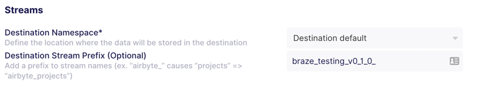

DBT project for App Metadata

### Getting started

#### Requirements
- python 3.9+
- virtualenv
- dbt (https://docs.getdbt.com/dbt-cli/install/homebrew)

1. Create virtualenv and install dbt:
    ```
    python3 -m venv venv
    source venv/bin/activate
    pip install -r requirements.txt
    ```
   
2. Append the following into the file: `~/.dbt/profiles.yml`. All transformed data will be stored in the project and dataset defined below.
After setting the <PROFILE_NAME> you need to modify the variable (`profile:`) in the file: `dbt_project.yml`.
    ```
    <PROFILE_NAME>:
      target: dev
      outputs:
        dev:
          dataset: <DATASET_ID>
          job_execution_timeout_seconds: 300
          job_retries: 1
          location: EU
          method: oauth
          priority: interactive
          project: <PROJECT_ID>
          threads: 1
          type: bigquery
   ```
   
3. Use gcloud to set and auth to your project:
    ```
    gcloud config set project <PROJECT_ID>
    gcloud auth application-default login \
     --scopes=https://www.googleapis.com/auth/bigquery,https://www.googleapis.com/auth/drive.readonly,https://www.googleapis.com/auth/iam.test
    ```
   
4. Run dbt debug to check your connections:
    ```
    dbt debug
    ```

5. Run dbt deps to install the dependencies:
    ```
    dbt deps
    ```
   
6. Run dbt run to make the transformations:
    ```
    dbt run
    ```
   
### Variables

- DATASET_ID: The dataset id from where the data will be read.
Usually is the same value as the one defined in the destination of the Airbyte connection.

- DEST_STREAM_PREFIX: The destination prefix if exists that was defined in the Airbyte connection.
Usually is the same values as the one defined in the tab "Replication" of the Airbyte connection.


### Production
For production/live environment, all these configurations are not needed. As we will use DBT to run through airbyte,
we will use the following configurations for each connection created in Airbyte.

When you create a connection in Airbyte, you will be prompted to enter 

1. Open a connection in the Airbyte UI, and click on the "Transformation" tab.
2. Go to the section "Custom Transformations" and click on button "+ Add transformation".
3. Chane the fields:
   - Transformation name: `#1 run`
   - Git repository URL of the custom transformation project: `the git url of this project` (for private repos: https://docs.airbyte.com/operator-guides/transformation-and-normalization/transformations-with-airbyte/#private-git-repository)
   - Entrypoint arguments for dbt cli to run the project: `--debug run --vars '{"DATASET_ID":"<DATASET_ID>","DEST_STREAM_PREFIX":"<DEST_STREAM_PREFIX>"}'`

If you do not define a DEST_STREAM_PREFIX in the Airbyte connection, you don't need to add it to the vars, or if you do, just add it as emptry string: `"DEST_STREAM_PREFIX":""`

### Resources:
- Learn more about dbt [in the docs](https://docs.getdbt.com/docs/introduction)
- Check out [Discourse](https://discourse.getdbt.com/) for commonly asked questions and answers
- Join the [chat](https://community.getdbt.com/) on Slack for live discussions and support
- Find [dbt events](https://events.getdbt.com) near you
- Check out [the blog](https://blog.getdbt.com/) for the latest news on dbt's development and best practices
